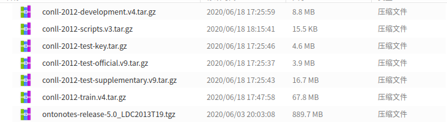
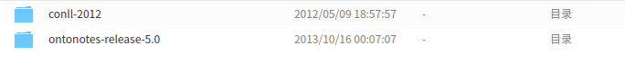

# Ontonotes5.0-pretreatment
ontonotes5.0 数据预处理，按照官方给的方式进行训练集、验证集、测试集的分割。Ontonotes5.0 pretreatment

## 创建原因
最近要做ner实验，但是github上给的教程都不够详细或者有错误，比如说[yhcc同学](https://github.com/yhcc/OntoNotes-5.0-NER)给的教程生成的数据没有测试集，其他几个也有或多或少的错误。经过查资料和学习别人的代码，找到了正确处理ontonote5数据的方式，在这里分享一下。

## 操作流程
### 下载处理程序和数据集
从[处理程序](http://cemantix.org/data/ontonotes.html)， [Ontonotes 5.0](https://catalog.ldc.upenn.edu/LDC2013T19)下载数据与处理程序，并放在某个文件夹下，解压前如图1。ontonotes5.0数据下载的时候，需要先在网站上注册，数据获取流程最好先查一查，还挺麻烦的。

解压到当前文件夹，解压后内容如图2，生成了两个文件夹，我把压缩包剪切走了。我是在linux下解压的，在Windows下解压的时候蹦了几个重复，不知道什么原因，建议在linux下解压。

在当前文件夹打开终端，创建py27环境，并执行第一步数据处理
conda create -n py27 python=2.7
source activate py27
./conll-2012/v3/scripts/skeleton2conll.sh -D ./ontonotes-release-5.0/data/files/data/ ./conll-2012/

切换回python3环境
source deactivate

把本项目上传的python程序放入解压文件所在文件夹，执行python xxx.py，就会生成一个result文件夹，里面是各个语言的预处理结果。因为比较感兴趣的是ner这块，所以处理的时候标记成了bio，感兴趣的可以在python程序上进行改动，以适应其他方向的处理需求

